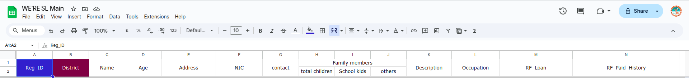
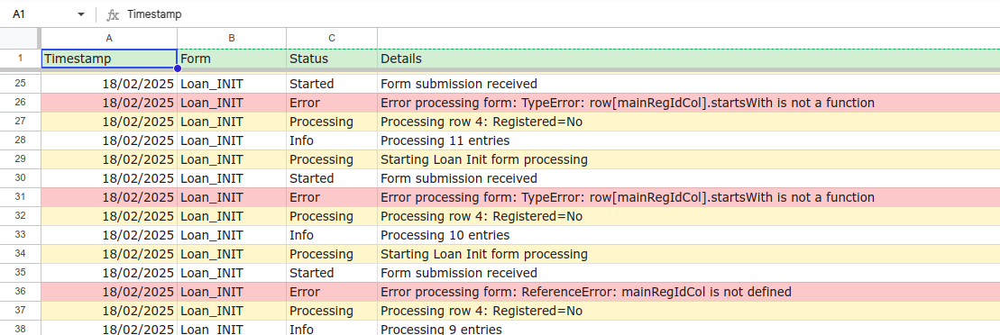
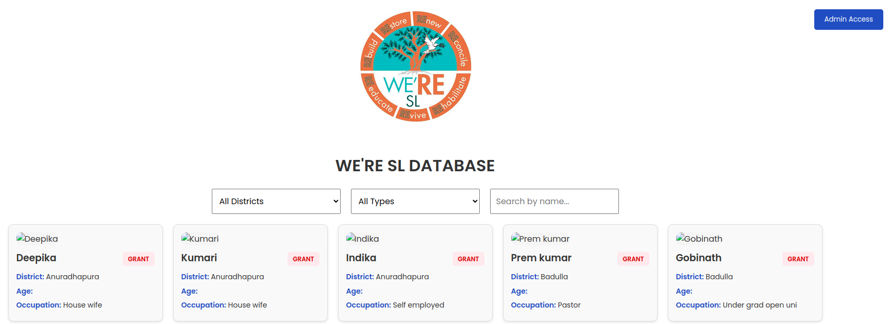
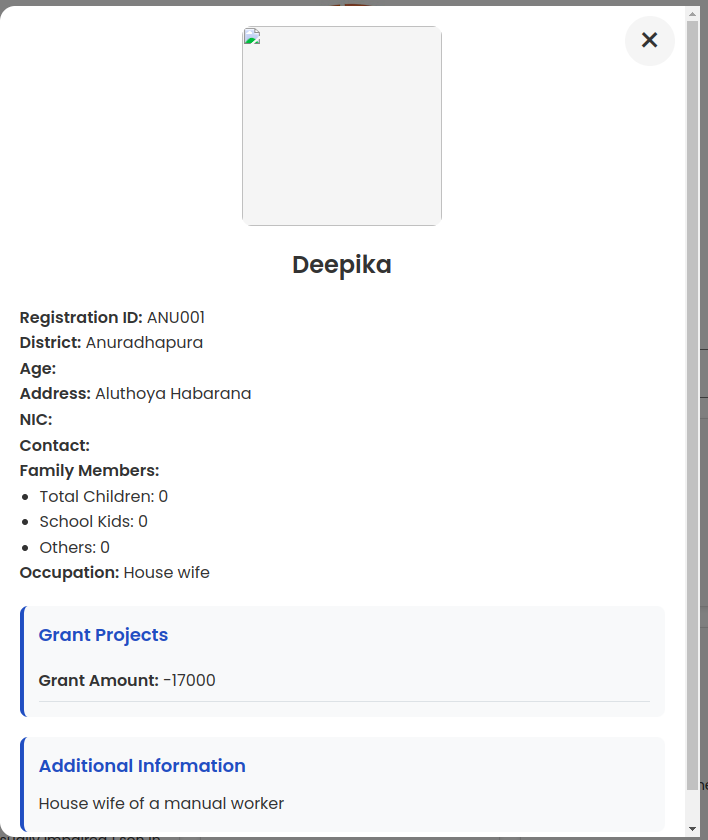
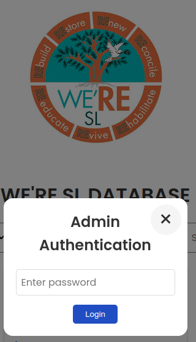
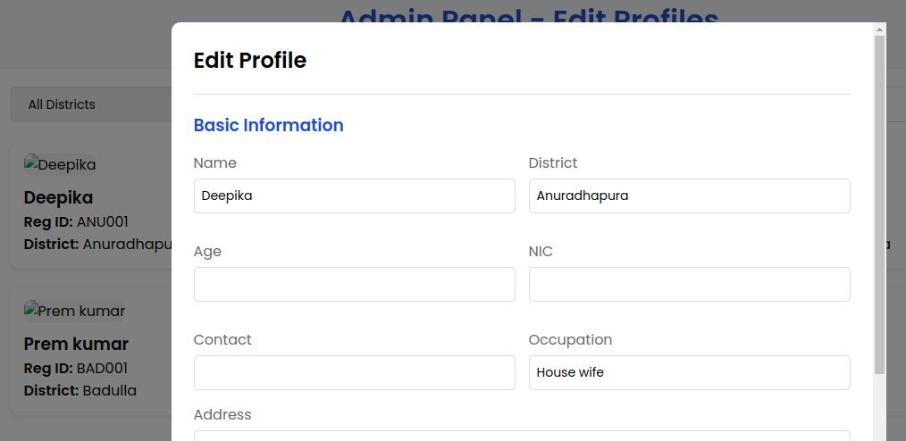
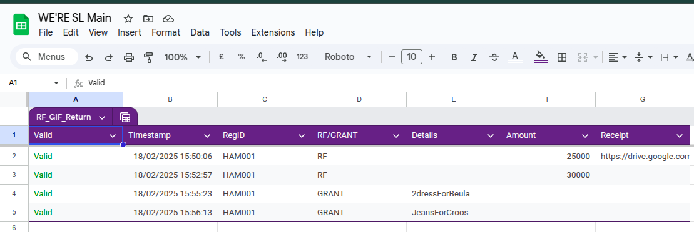

# WeRE SL Web Application

A web-based database management system for tracking and managing loans, grants, and "Give It Forward" initiatives for beneficiaries across different districts in Sri Lanka.


## Overview

WeRE SL Web Application is built using Google Apps Script and Google Sheets as a backend database. It provides a user-friendly interface for managing beneficiary profiles, tracking various types of financial assistance (RF Loans, Grants, and Give It Forward programs), and monitoring project progress across different districts in Sri Lanka.

## Features

### Public Interface
- Profile browsing with filtering capabilities
  - Filter by district
  - Filter by assistance type (RF/Grant)
  - Search by beneficiary name
- Detailed profile view showing:
  - Personal information
  - Project history
  - RF Loan details
  - Grant details
  - Give It Forward contributions
  - Family information
- Responsive design for mobile and desktop viewing

### Administrative Features
- Secure admin access
- Form processing for:
  - RF/GIF Returns
  - Loan Initialization
- Automated RegID generation
- Project status tracking
- Payment history management
- System logging

## Technical Architecture

### Frontend
- HTML5
- CSS3
- JavaScript
- Google Apps Script HTML Service
- Responsive design using Flexbox
- Custom modal system for detailed views

### Backend
- Google Apps Script
- Google Sheets as database
- Custom logging system
- Form trigger management

### Database Structure (Main Sheet)
- RegID
- District
- Personal Information
- Loan Details
- Grant Details
- Project Status
- Payment History
- Give It Forward Records

## Key Functions

### User Interface
```javascript
- filterProfiles(): Handles profile filtering based on district and type
- displayProfiles(): Renders profile cards in the UI
- showModal(): Displays detailed profile information
- formatProjectString(): Formats project data for display
```

### Backend Processing
```javascript
- onRFGIFReturnSubmit(): Processes return payments
- onLoanInitFormSubmit(): Handles new loan applications
- getDistrictFromRegID(): Extracts district information
- logToSheet(): System logging functionality
```

## Security Features
- Password-protected admin access
- Form validation
- Data integrity checks
- Secure Google infrastructure

## Setup Requirements

1. Google Workspace account
2. Google Sheet with the following sheets:
   - Main
   - RF_GIF_Return
   - Loan_INIT
   - System_Logs

3. Google Apps Script project with the following files:
   - Code.gs (backend logic)
   - index.html (public interface)
   - admin.html (admin interface)

## Installation

1. Create a new Google Sheet
2. Set up the required sheets (Main, RF_GIF_Return, Loan_INIT, System_Logs)
3. Open Apps Script from Tools > Script editor
4. Copy the provided Code.gs content
5. Create HTML files and copy the respective content
6. Deploy as a web app
7. Set up necessary permissions

## Usage

### Public Access
1. Access the deployed web app URL
2. Browse profiles using filters
3. Click on profiles to view detailed information



### Administrative Access

1. Click "Admin Access" button
2. Enter admin password
3. Access administrative features
4. Process returns and new applications





## Acknowledgments

* Based on Galatians 6:9
* Created for community development in Sri Lanka
* Special thanks to all contributors and beneficiaries

## Contact

For any queries regarding the application, please contact the WeRE SL team.
